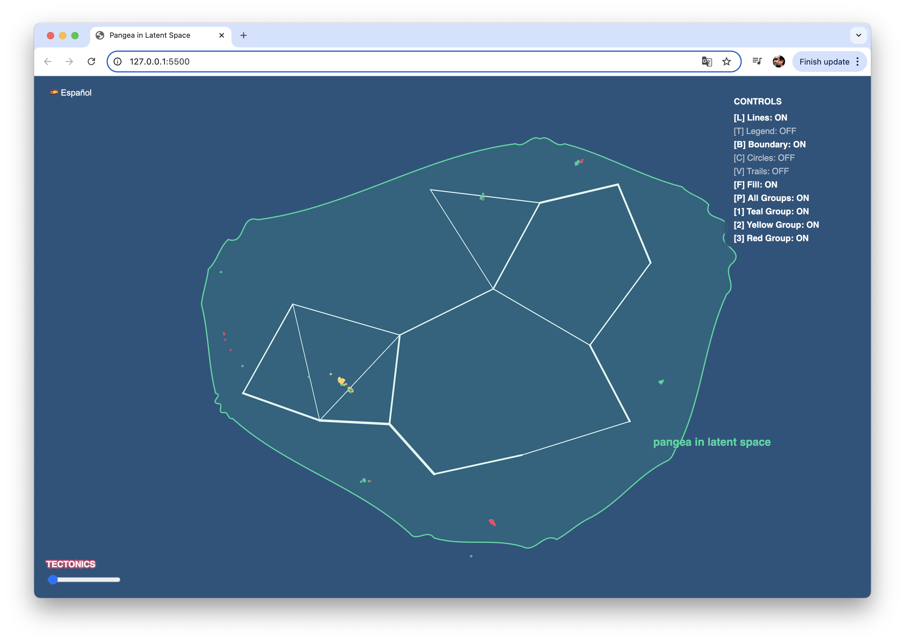
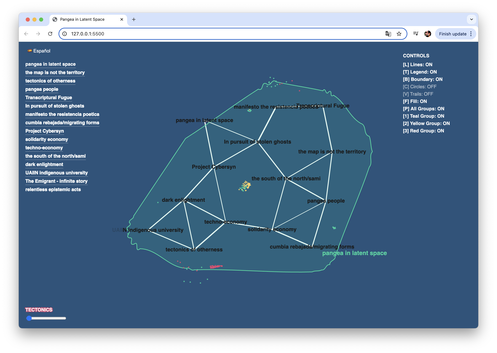
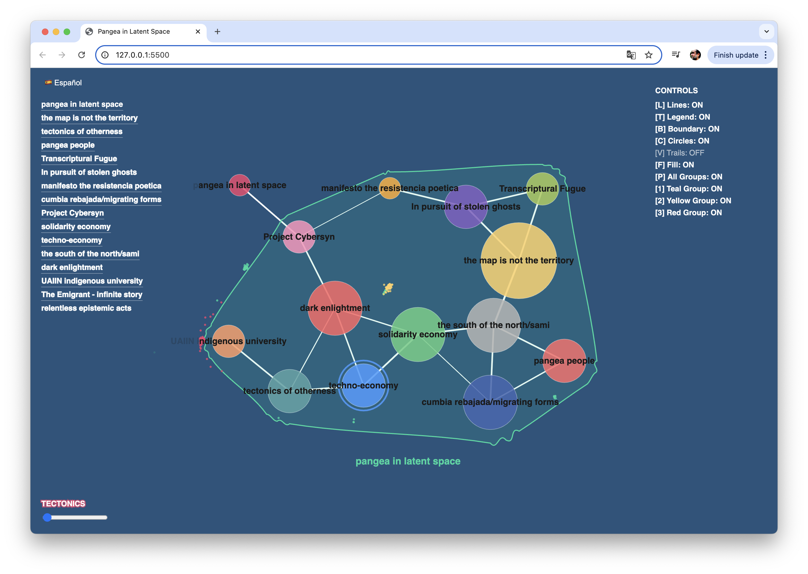

# Pangea in Latent Space

An interactive visualization exploring connections between concepts, territories, and epistemologies through a dynamic network of floating nodes.

🔗 [Live App](https://transcripturalfugue-marlonbarrios-projects.vercel.app)

## Preview

*Dynamic network visualization with interactive nodes*

*Bilingual interface with concept connections*

*Interactive controls and list view*

## Description

This project visualizes interconnected concepts as a living, breathing network. Each node represents a key concept or project, with dynamic connections forming between them as they move through space. The visualization includes:

- Interactive floating nodes with clickable links
- Bilingual support (English/Spanish)
- Dynamic boundary visualization
- Multiple visualization modes
- Fluid animation with adjustable speed
- Responsive design that adapts to window size

## Features

- **Dynamic Network**: Nodes float and connect based on proximity
- **Interactive Elements**: 
  - Hover over nodes to highlight connections
  - Click nodes to visit related resources
  - Toggle different visualization modes
  - Adjust animation speed
- **Bilingual Interface**: 
  - Toggle between English and Spanish
  - Full translation of all UI elements and concepts
- **Control Panel**:
  - Lines [L]: Toggle connection lines
  - Legend [T]: Show/hide text labels
  - Circles [C]: Toggle node visibility
  - Boundary [B]: Show/hide boundary
  - Trails [V]: Enable visual trails
  - Fill [F]: Toggle boundary fill
- **List View**: Access all concepts with direct links

## Controls

- Use the control panel in the top-right corner to toggle different visualization modes
- Click the language button to switch between English and Spanish
- Use the slider at the bottom to adjust the movement speed
- Press [Space] to toggle the concept list

## Technologies

- p5.js for visualization and interaction
- HTML5 Canvas for rendering
- JavaScript for dynamic behavior

## Credits

Created by Marlon Barrios Solano

## License

This project is licensed under the MIT License - see the LICENSE file for details 